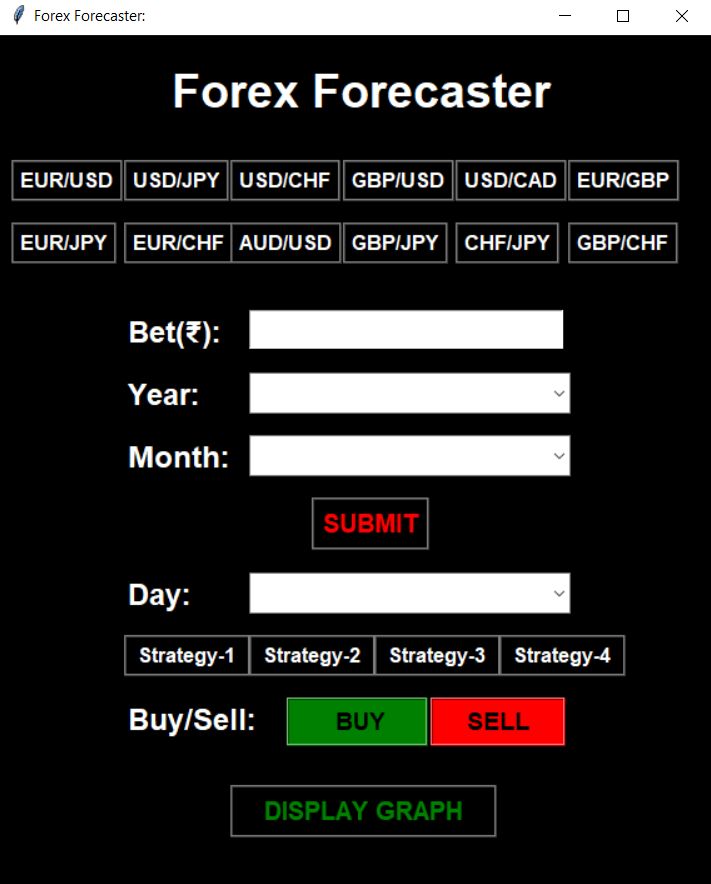

# Forex-Forecaster
It is a Currency Sentiment Tool that analysis Forex Exchange Rates as a Binary Classification Problem with Uptrend and Downtrend Outcomes with the help of Four Different Strategies - Using Patterns, Monte Carlo Method, ML, Regression. It helps in determining appropriate and profitable Entry and Exit points along with Candlestick analysis. Made as a part of Semester III Project.

